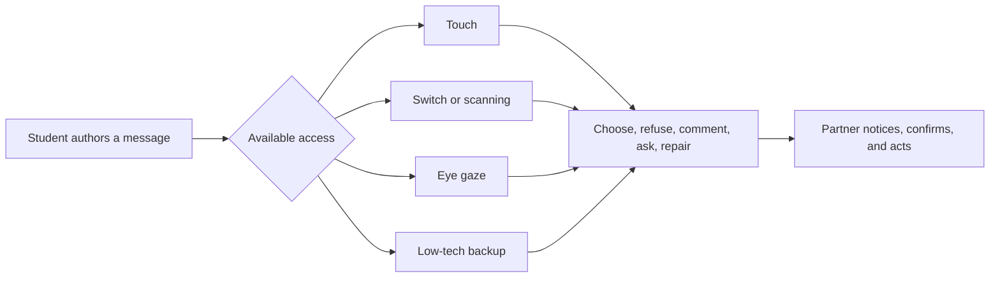

# AAC Review: TD Snap

## Review Draft - Not Posted

For my AAC review, I selected **TD Snap**, an augmentative and alternative communication application from Tobii Dynavox. The application offers multiple page sets, including Core First, Motor Plan, Express, Text, Scanning, and Aphasia. It can be configured for different access methods, including touch, switch scanning, and eye gaze. This flexibility matters because students with complex communication needs do not share one motor, sensory, visual, language, or literacy profile.

### Benefits

TD Snap's greatest strength is not that the app can speak; it is that the system can be matched to different communicators and purposes. Symbol-supported and text-based page sets allow a team to consider current access while planning for vocabulary and literacy growth. In a classroom, a student could use the system to greet a peer, choose a group role, make a prediction, reject a material, ask for clarification, comment on a model, request sensory support, or say, “I meant something else.” Printable low-tech versions can also help preserve communication when a device is charging, unavailable, difficult to position, or not the student's preferred mode in that moment.

This matches Mirenda's (2015) description of AAC as a continuously updated multimodal system rather than a single device. It also addresses the implementation problem identified by Norrie, Waller, and Hannah (2021): technology becomes meaningful only when training, technical support, partners, and daily routines make it usable.

### Challenges

TD Snap still requires careful feature matching, customization, funding or device access, partner training, and time. Multiple page sets are an advantage only if the team selects and organizes them with the communicator rather than continually changing the layout around the student. Adults may also program mostly requests or behavior-management phrases while leaving out questions, comments, humor, academic vocabulary, refusal, identity, and repair. A powerful application can therefore reproduce a narrow adult agenda.

There are practical risks too. A device can be left on a shelf, removed during transitions, used only with one specialist, or treated as inconvenient during hands-on activities. Norrie et al. (2021) show that these are implementation failures, not evidence that a student is incapable of AAC. Communication partners must keep the system available, model without demanding imitation, wait, confirm meaning, and honor messages even when a refusal or correction changes the adult's plan.

### Personalized Classroom Use

I would use TD Snap during an evidence-to-action science routine modeled on my EDU486 camp work. Youth at camp could contribute through tool use, drawing, labels, arrows, photographs, speech, partnering, observation, pausing, and returning. For a student using TD Snap, I would prepare both core vocabulary and activity-specific words such as *observe, compare, evidence, change, agree, different, smell, texture,* and *show me*. The student would be able to choose a role, comment on evidence, reject a sensory material, request another access route, or help teach the final model. A printed board would remain available beside the device.

### Overall Review

TD Snap is a strong option when its page set and access method fit the communicator and when the team treats it as one part of a multimodal system. Its flexibility is a major benefit; shallow or inconsistent implementation is the central challenge. My final test comes from EQUITAS, the equity-centered heart of my Puzzle Plan: after the support is introduced, can the student author more kinds of messages and exercise more influence over learning, relationships, and the environment? If the answer is yes, the tool is increasing access-to-agency. If not, the team must revise the system rather than blame the student.

## Sources

- [Tobii Dynavox: TD Snap](https://us.tobiidynavox.com/products/td-snap)
- [ASHA AAC overview](../reading-summaries/themed_overview/augmentative-and-alternative-communication-aac-themed-overview.md)
- [Mirenda (2015)](../reading-summaries/themed_overview/developing-acquiring-communication-aids-themed-overview.md)
- [Norrie et al. (2021)](../reading-summaries/themed_overview/norrie-et-al-2021-context-for-aac-themed-overview.md)

## Classmate Reply - Complete Only After Posts Are Visible

I appreciated your review of **[tool]**, especially your point about **[specific detail from the classmate's post]**. One connection I noticed with TD Snap is **[evidence-based comparison]**. How does the tool support **[access method, vocabulary growth, bilingual use, repair, or use across routines]**? That question matters to me because implementation and partner response can expand or restrict what even a strong AAC tool makes possible.
