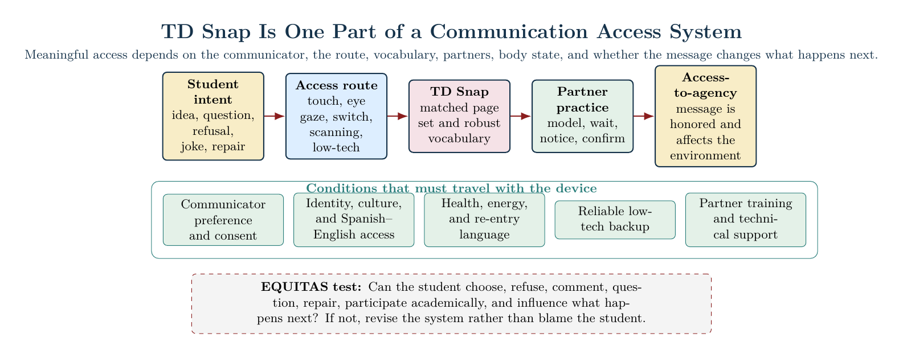

# AAC Review: TD Snap

## Discussion Post Draft - Not Posted

For my AAC tool review, I selected **TD Snap**, an augmentative and alternative communication app/software system from Tobii Dynavox. TD Snap is designed for people with speech and language disabilities and can be used with different access methods, including touch, eye gaze, and switch access. It also offers multiple page sets, including Core First, Motor Plan, Express, Text, Scanning, Aphasia, and optional page sets such as PODD or Gateway through in-app purchase. That flexibility matters because students with complex communication needs do not share one motor, sensory, visual, language, health, or literacy profile.

*Figure 1. TD Snap is one component of a multimodal communication system. The diagram shows communicator intent moving through an accessible route, matched vocabulary, and responsive partner practice before becoming agency. The EQUITAS test asks whether the student can author varied messages and influence what happens next.*

### Summary of the Tool

TD Snap is not only a speech button app. It is a customizable AAC platform with symbol-supported and text-based page sets, editing tools, search tools, visual supports, QuickFires, training resources, and printable low-tech materials. The Motor Plan page set is especially relevant to this module because it supports word-by-word sentence construction and consistent motor plans. Tobii Dynavox describes Motor Plan as available in English, Spanish, and Spanish/English bilingual options, including Castellano and Latin American Spanish, with 30-, 40-, and 66-position layouts. That makes the tool worth considering for students who need bilingual access, consistent vocabulary locations, and a path from early language toward more complex communication.

I also noticed an important practical issue: the iPad app is free to download, but the App Store currently states that a monthly subscription is required to enable speech after a one-month trial. That means funding, device ownership, school licensing, and family access cannot be treated as small details. A tool that is technically strong can still fail a student if the voice output, page set, backup system, training, or account access does not travel across the student's real day.

### Benefits

The strongest benefit of TD Snap is **feature matching**. A team can consider different page sets, grid sizes, access routes, visual supports, and vocabulary organization instead of assuming one AAC layout fits every student. For a neurodivergent CLD student like the fictional Mateo in my Communication Support Plan, TD Snap's bilingual options could protect Spanish-English communication and family vocabulary. For a student like Eli, the value would be the combination of robust vocabulary, low-tech backup, and flexible access methods. For a chronically ill low-speaking student like Luca, the system would need health and body vocabulary such as *tired, pain, private, no voice today, slower, later,* and *ready* so that illness, fatigue, and speech trauma are not misread as refusal or noncompliance.

Another benefit is that TD Snap can support more than requesting. It can help students greet, comment, ask questions, reject a material, repair a misunderstanding, choose a peer role, participate academically, joke, and influence what happens next. This connects directly to ASHA's position that there are no prerequisite skills for beginning AAC and to our Module 3 readings that frame AAC as a multimodal system supported by partners, routines, and implementation conditions.

### Challenges

The biggest challenge is that TD Snap is only as inclusive as the implementation around it. A robust app can become narrow if adults mostly program compliance phrases, remove the device during hands-on work, change layouts without student input, or treat speech output as the only valid message. The DoDEA parent-training guidance reminded me that partners need to learn the tool, model while talking, keep the device available all day, and wait for the communicator. Without that partner behavior, the technology may be present but communication access is still missing.

There are also practical barriers: subscription cost, iPad/device access, app size/storage, internet or account management, staff training, and time for personalization. Optional page sets can be useful, but they can also create confusion or extra cost if the team keeps switching systems before learning what the student already understands. TD Snap should therefore be selected through student, family, SLP, teacher, and team input rather than because it looks polished.

### Overall Review

My overall review is positive, with conditions. TD Snap appears to be a strong AAC option when the page set, access method, vocabulary, language options, backup system, and partner supports are matched to the communicator. I would not treat it as a magic fix or as proof that the student is now responsible for all communication breakdowns. Through my Puzzle Plan, I would ask how the tool connects the student's lived experience, language, body state, environment, family knowledge, and instructional goals. Through EQUITAS, I would ask the fairness question: after TD Snap is introduced, does the student have more power to choose, refuse, comment, question, repair, participate, protect boundaries, and affect the environment? If yes, the tool is supporting access-to-agency. If not, the team must revise the system rather than blame the student.

### Sources Used

- [Tobii Dynavox: TD Snap overview](https://www.tobiidynavox.com/pages/td-snap)
- [Tobii Dynavox: TD Snap Motor Plan](https://us.tobiidynavox.com/pages/td-snap-motor-plan)
- [Apple App Store: TD Snap](https://apps.apple.com/us/app/td-snap/id1072799231)
- [DoDEA AAC Toolkit](https://sites.google.com/student.dodea.edu/dodea-aac-toolkit/)
- [DoDEA AAC Toolkit: Parent Training](https://sites.google.com/student.dodea.edu/dodea-aac-toolkit/parent-training)
- [ASHA: Augmentative and Alternative Communication](https://www.asha.org/njc/aac/)

## Classmate Reply - Complete Only After Posts Are Visible

I appreciated your review of **[tool]**, especially your point about **[specific detail from the classmate's post]**. One connection I noticed with TD Snap is **[evidence-based comparison]**. I am wondering how your tool handles **[access method, vocabulary growth, bilingual use, repair language, low-tech backup, or use across routines]**. That question matters to me because a strong AAC tool still depends on partner training, student consent, and whether the student's message actually changes what happens next.
